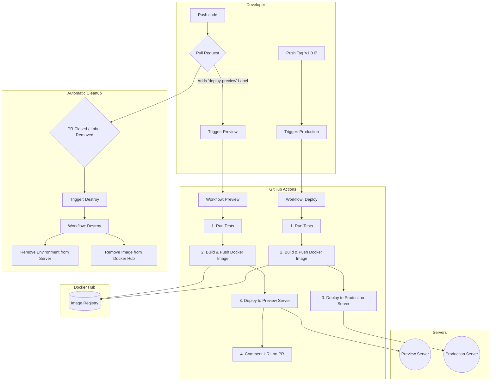

# Dev-Flow: A CI/CD Template for Laravel

[](https://github.com/devc4rlos//dev-flow/actions/workflows/ci.yaml)

[](https://conventionalcommits.org)
[](https://github.com/devc4rlos/dev-flow/blob/main/LICENSE)

This project, named **Dev-Flow**, is a template and a demonstration of a complete and robust CI/CD pipeline for Laravel applications. The goal is to provide a modern, automated, and production-ready development workflow using industry best practices with Docker and GitHub Actions.

More than just an application, this repository serves as a **practical guide** for implementing:

* Continuous Integration (CI)
* Ephemeral Preview Environments
* Continuous Deployment (CD)

-----

## Local Development

This project uses [Laravel Sail](https://laravel.com/docs/sail) for a consistent and simplified local development experience with Docker.

### Prerequisites

* Docker Desktop

### Installation Steps

1.  Clone the repository:

    ```bash
    git clone https://github.com/devc4rlos/dev-flow.git
    cd dev-flow
    ```

2.  Copy the example environment file:

    ```bash
    cp .env.example .env
    ```

3.  **Configure the Database for Sail**

    Open the `.env` file you just created and edit the database connection variables. The default (`sqlite`) will not work with Sail, which uses a MySQL container.

    **Change from:**

    ```env
    DB_CONNECTION=sqlite
    # DB_HOST=127.0.0.1
    # DB_PORT=3306
    # DB_DATABASE=laravel
    # DB_USERNAME=root
    # DB_PASSWORD=
    ```

    **To:**

    ```env
    DB_CONNECTION=mysql
    DB_HOST=mysql
    DB_PORT=3306
    DB_DATABASE=dev-flow
    DB_USERNAME=sail
    DB_PASSWORD=password
    ```

4.  Install Composer dependencies:

    ```bash
    docker run --rm \
        -u "$(id -u):$(id -g)" \
        -v "$(pwd):/var/www/html" \
        -w /var/www/html \
        laravelsail/php84-composer:latest \
        composer install --ignore-platform-reqs
    ```

5.  Start the Sail containers in the background:

    ```bash
    ./vendor/bin/sail up -d
    ```

6.  Generate the application key:

    ```bash
    ./vendor/bin/sail artisan key:generate
    ```

7.  Run the database migrations:

    ```bash
    ./vendor/bin/sail artisan migrate
    ```

**Done\!** The application will be accessible at `http://localhost`.

-----

## Key Features

The workflow implemented in this project automates the entire lifecycle of a change, from commit to production.

* **Full Containerization with Docker**

    * **Multi-stage Dockerfile** optimized for production, resulting in lightweight and secure images.
    * Separate **Docker Compose** configurations for different environments (CI, Preview, Production).
    * Local development environment with **Laravel Sail**.

* **Continuous Integration (CI)**

    * A reusable workflow (`reusable-ci.yaml`) runs the test suite (PHPUnit) automatically on every `push` or `pull request` to the `main` branch, ensuring code quality and integrity.

* **Ephemeral Preview Environments**

    * By adding a *label* (e.g., `deploy-preview`) to a pull request, a complete and isolated deployment environment is automatically created on a server.
    * A unique Docker image for the PR is built and pushed to Docker Hub.
    * The environment is protected by **HTTP Basic Authentication**, ensuring only the team can access it.
    * The **access URL** is posted as a comment on the pull request itself.
    * When the PR is closed or the *label* is removed, the environment is **completely destroyed** (containers, volumes, images, networks, and files), freeing up all server resources.

* **Continuous Deployment (CD)**

    * Deployment to production is triggered **exclusively** by pushing a **Git tag** in the format `v*.*.*` (e.g., `v1.0.0`).
    * The workflow runs tests, builds a Docker image tagged with the release version, and pushes it to Docker Hub.
    * The deployment script on the server is **resilient**, including migration retries and a **readiness check** to ensure the application is 100% online before finalizing the deployment.

-----

## Architecture Diagram

The diagram below illustrates the automation flow implemented in this project.



-----

## Technologies Used

* **Framework:** Laravel
* **Web Server:** Nginx
* **Database:** MySQL
* **Containerization:** Docker & Docker Compose
* **CI/CD:** GitHub Actions
* **Reverse Proxy:** Traefik (for automatic routing and SSL)

-----

## How It Works

### 1\. Development Workflow (Pull Request)

1.  A developer opens a Pull Request.
2.  The **CI** workflow (`ci.yaml`) is triggered and runs the tests.
3.  To validate the changes in a real-world environment, the developer adds the `deploy-preview` *label*.
4.  The **Preview** workflow (`preview.yaml`) is triggered:
    * Runs the tests again.
    * Builds and pushes an image like `your-username/my-project:pr-123` to Docker Hub.
    * Connects to the server and runs `deploy-preview.sh`, which uses `compose.preview.yaml` to spin up the environment.
    * Posts a comment on the PR with the URL: `https://my-project-pr-123.preview.your-domain.com`.
5.  After approval and merge, the PR is closed.
6.  Closing the PR triggers the destroy step, which removes all resources from the server and the image from Docker Hub.

### 2\. Release Workflow (Production)

1.  After merging to `main`, a maintainer decides to create a new version.
2.  The command `git tag v1.1.0 && git push origin v1.1.0` is executed.
3.  The **Deploy** workflow (`deploy.yaml`) is triggered:
    * Runs the tests.
    * Builds and pushes the `your-username/my-project:v1.1.0` image to Docker Hub.
    * Connects to the production server and runs `deploy-production.sh`, which uses `compose.production.yaml` to update the application.

-----

## How to Use This Template

To adapt this project for your own use, follow these steps:

### 1\. Prerequisites

* A server (VPS) with Docker, Docker Compose, and Traefik configured.
* An account on an image registry (like Docker Hub).
* A domain for your preview and production environments.

### 2\. GitHub Configuration

Configure the following `Variables` and `Secrets` in your GitHub repository (`Settings > Secrets and variables > Actions`):

#### Repository Secrets

| Name                 | Description                                           | Example                 |
|----------------------|-------------------------------------------------------|-------------------------|
| `VPS_HOST`           | The IP address or domain of your deployment server.   | `192.168.1.1`           |
| `VPS_USER`           | The SSH user to connect to the server.                | `dev-flow`              |
| `VPS_SSH_KEY`        | The private SSH key for authentication on the server. | `-----BEGIN OPENSSH...` |
| `DOCKERHUB_USERNAME` | Your Docker Hub username.                             | `my-username`           |
| `DOCKERHUB_TOKEN`    | Your Docker Hub access token.                         | `dckr_pat_...`          |
| `APP_KEY_CI`         | A Laravel `APP_KEY` for running tests.                | `base64:Abcde...`       |

#### Repository Variables

| Name                          | Description                                              | Example                     |
|-------------------------------|----------------------------------------------------------|-----------------------------|
| `PROJECT_NAME`                | Project name, used for domains and service names.        | `my-project`                |
| `DOMAIN_PREVIEW`              | Base domain used for preview environments.               | `preview.example.com`       |
| `LABEL_PREVIEW`               | A label for service discovery and routing.               | `com.example.app`           |
| `HOSTNAME`                    | The full hostname (FQDN) for the production environment. | `app.example.com`           |
| `DEPLOY_PREVIEW_LABEL`        | The *label* that triggers the preview deployment.        | `deploy-preview`            |
| `ALLOWED_AUTHOR_ASSOCIATIONS` | Allowed author associations to trigger the preview.      | `MEMBER,OWNER,COLLABORATOR` |

### 3\. Server Configuration

* Create the external volumes for production using the format `${PROJECT_NAME}-production-db-data` and `${PROJECT_NAME}-production-storage-data`. For example: `docker volume create my-project-production-db-data`.
* Clone the repository to the location defined in `PROJECT_DIR`.
* Ensure that Traefik is running and connected to the external `proxy` network.

With that, your project will be ready to follow the same CI/CD flow demonstrated here.

-----

## Contributing

Contributions are very welcome\! If you have ideas for improving this workflow, feel free to open an *issue* to discuss or submit a *pull request*.

-----

## License

This project is open-source software licensed under the [MIT license](https://opensource.org/licenses/MIT).